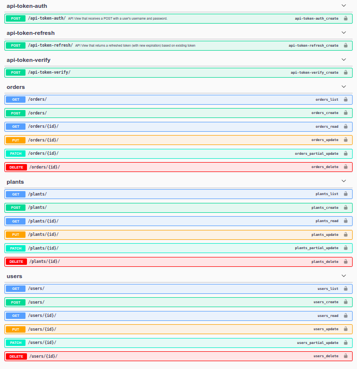

# Plant Nursery Marketplace API

      


## Index

- [Index](#index)
- [About](#about)
- [Flow](#flow)
  - [Installation](#installation)
- [File Structure](#file-structure)
- [Guideline](#guideline)
- [Gallery](#gallery)
- [Endpoints](#endpoints)
- [Credit/Acknowledgment](#creditacknowledgment)


## About
This is a REST API on Plant Nursery Marketplace, it supports adding/removing a plant to the cart and making purchase, it also supports viewing orders, here nurseries can act as sellers as well as buyers i.e. they can place orders as well as maintain their own catalouge of plants to sell, I've used JsonWebTokens based authentication scheme in this API along with some custom permissions to allow the views to be protected accordingly, I have also added a documentation for this API using swagger open API specification, after running the server visit http://127.0.0.1:8000/docs/ to view the documentation, to know the flow for testing the API visit API.md file in this repo, the database used is PostgreSQL.


### Flow

- check API.md

### Installation

**Development**

To do a simple test run of the application, follow these steps.

- Clone the repository

```bash
$ git clone git@github.com:code-monk08/marketplace.git
```

- Create the virtualenv and activate it

```bash
$ cd marketplace
$ python -m venv env
$ source env/bin/activate # Linux
```

- Install requirements

```bash
(env)$ pip3 install -r requirements.txt
```


- Setup the database

```bash
$ sudo su - postgres
$ psql
postgres=# CREATE USER your_custom_username WITH PASSWORD "your_custom_password";
postgres=# CREATE DATABASE plant_marketplace WITH OWNER your_custom_username ENCODING 'utf-8';
postgres=# GRANT ALL PRIVILEGES ON DATABASE "plant_marketplace" to your_custom_username;
```

- Setup the project


```
Fill out USER & PASSWORD with your username and password obtained from above step in marketplace/settings.py in:

DATABASES = {
    "default": {
        ...
        "USER": "",
        "PASSWORD": "",
        ...
        }
}
```
```bash
$ python3 manage.py makemigrations
$ python3 manage.py migrate
$ python3 manage.py runserver
```

## File Structure
- Project structure

```
.
├── manage.py
├── marketplace
│   ├── asgi.py
│   ├── __init__.py
│   ├── settings.py
|   ├── .env
│   ├── urls.py
│   └── wsgi.py
├── plants
│   ├── admin.py
│   ├── apps.py
│   ├── __init__.py
│   ├── migrations
│   │   ├── 0001_initial.py
│   │   └── __init__.py
│   ├── models.py
│   ├── serializers.py
│   └── views.py
├── README.md
└── requirements.txt

3 directories, 17 files
```

## Guideline

- __Code Style__

In order to maintain the code style consistency across entire project we use a code formatter. Therefore, we kindly suggest you to do the same whenever you push commits to this project. 

The python code formatter we chose is called black. Black is a great tool and it can be installed quickly by running 

`pip3 install black`.  

or

`python3.6 -m pip install black`

It requires Python 3.6.0+ to run.

- __Usage__

`black {source_file_or_directory}`

For more details and available options, please check the [GitHub project](https://github.com/psf/black).

## Endpoints

`Available endpoints: to check the complete specification of API, visit Swagger UI after setting up the project`

<p align="center">
  
</p>

## Credit/Acknowledgment

[](https://github.com/code-monk08/marketplace/graphs/contributors)